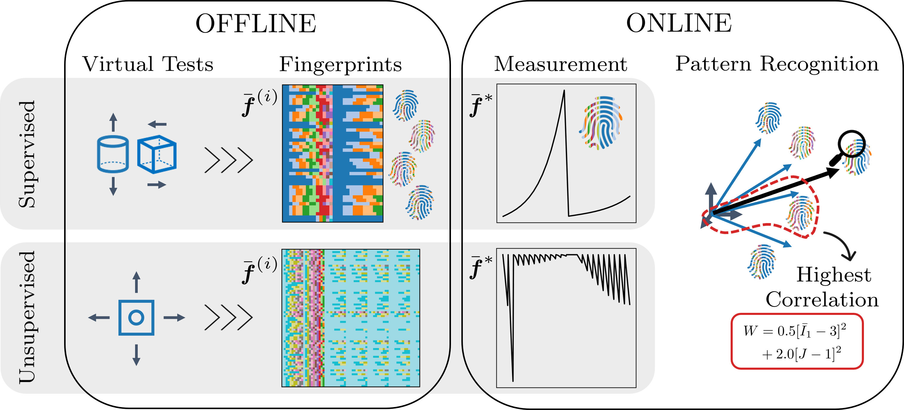

We propose Material Fingerprinting, a new method for the rapid discovery of mechanical material models from direct or indirect data that avoids solving potentially non-convex optimization problems. The core assumption of Material Fingerprinting is that each material exhibits a unique response when subjected to a standardized experimental setup. This response can be interpreted as the material's fingerprint, essentially a unique identifier that encodes all pertinent information about the material's mechanical characteristics. Consequently, if a database containing fingerprints and their corresponding mechanical models is established during an offline phase, an unseen material can be characterized rapidly in an online phase. This is accomplished by measuring its fingerprints and employing a pattern recognition algorithm to identify the best matching fingerprint in the database.



The figure above illustrates the concept of Material Fingerprinting in both direct and indirect experimental setups. The supervised case involves homogeneous deformation fields, yielding direct strain-stress data pairs. The unsupervised case, in contrast, uses complex specimen geometries that produce heterogeneous deformation fields and only provide indirect displacement and force measurements.


At the core of Material Fingerprinting is a straightforward pattern recognition algorithm. The figure above demonstrates how a new measurement is compared against all fingerprints in the database, correctly identifying the underlying material model — in this case, the Ogden model.


## Reference

```
Moritz Flaschel, Denisa Martonová, Carina Veil and Ellen Kuhl  
Material Fingerprinting: A shortcut to material model discovery without solving optimization problems  
2025  
DOI: 
```

## How to cite the code

```
Moritz Flaschel, Denisa Martonová, Carina Veil and Ellen Kuhl  
Supplementary software for "Material Fingerprinting: A shortcut to material model discovery without solving optimization problems"  
2025  
DOI: 
```